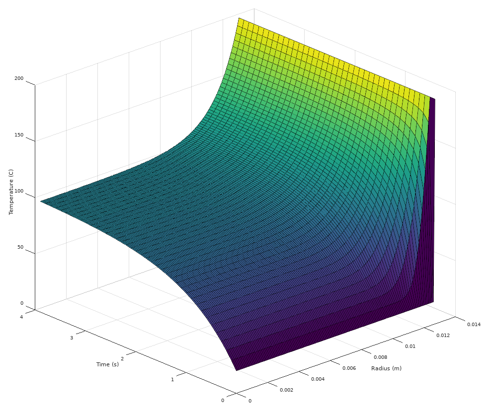

# heatsim
Solves a heat diffusion equation by finite differences.
Written in D.

See inline documentation for more info.
Note: this integration method is not guaranteed to converge depending on the input.

* [**`heatsim.d`**](src/heatsim.d)
is the package containing the `solve()` function.
It also contains helper functions `output()` and `getInput()`.

* [**`main.d`**](src/main.d)
provides an example of usage (a poor substitute for a proper test). A sample input file `fileInput.txt` is provided, and the output can be written to another file. Is is also possible to get input and output in the console; all this depends on command line parameters.
If compiled with the `peek` debug identifier, after calculation the program will also try to visualize the output. If GNU Octave is installed (and available in `PATH`) it will be plotted; otherwise the program will simply try to open the output file in an associated editor.

* The [**`doc/`**](doc/) directory
contains various explanatory documents (not code).
