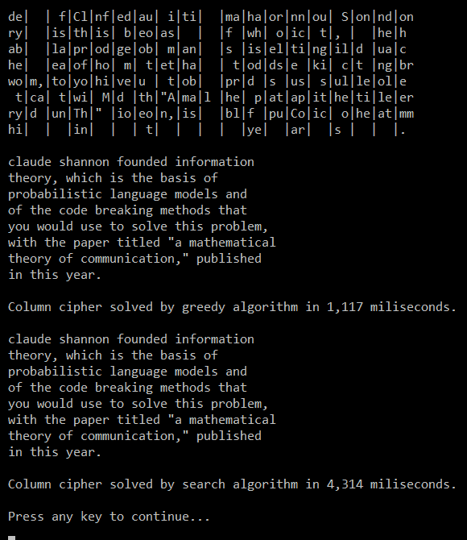

# nlp-cyphers
Solving simple word cyphers with probabilistic Natural Language Processing and search algorithms, in C#.

This was the optional final exercise for the original Stanford "massive open online course" [ai-class.com](http://web.archive.org/web/20111118013708/https://www.ai-class.com/).
Two cyphers are solved: a rotation and a column swap one.
Solvers are implemented as separate classes, and all are run from `Program.Main()`.
For the (more complex) column cypher, two strategies are implemented: greedy (`ColumCipherGreedy` class) and A* search (`ColumCipherSearch`).
For the sample input provided, both succeed fully, and the greedy algorithm is quite faster.
The rotation cypher solver is implemented in the class `RotationCipher`.

The program requires a word dictionary to calculate word probabilities.
It must be a text file with one word in each line.
One is provided as `WordDictionary.txt`.

Input (text of both cyphers) is taken from the `.config` XML file
-- probably not the handiest thing.

Ouput shown below, from sample input.
The program outputs an animation of the search onto the console, which surely slows the whole thing some orders of magnitude, so the measured times are not actually boasting just informative.

