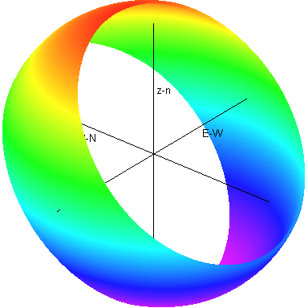

# sunpos
Calculates the position of the Sun at any time of the year,
with respect to any point on Earth's surface
(latitude, longitude).

- [**`sunpos.mac`**](src/sunpos.mac)
Version written in [Maxima](https://en.wikipedia.org/wiki/Maxima_(software)).
Not tested at all.
- [**`sunpos.mw`**](src/sunpos.mw)
Version written in an old version of [Maple](https://en.wikipedia.org/wiki/Maple_(software)).
Not very human readable, as Maple's format is XML.
Not very tested, but the all-year-round plots seem to work OK.

- [**`documentation/sample-locations/`**](documentation/sample-locations/)
Directory containing plots
(created with the Maple version, although also possible with Maxima //TODO)
of the space swept by the Sun along one year,
as seen from different latitudes.
- [**`documentation/theory.png`**](documentation/theory.png)
Explains the theory behind the algebra
-- much like the comments in `sunpos.mac`.
